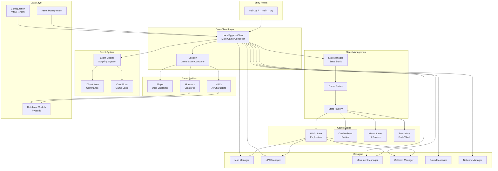
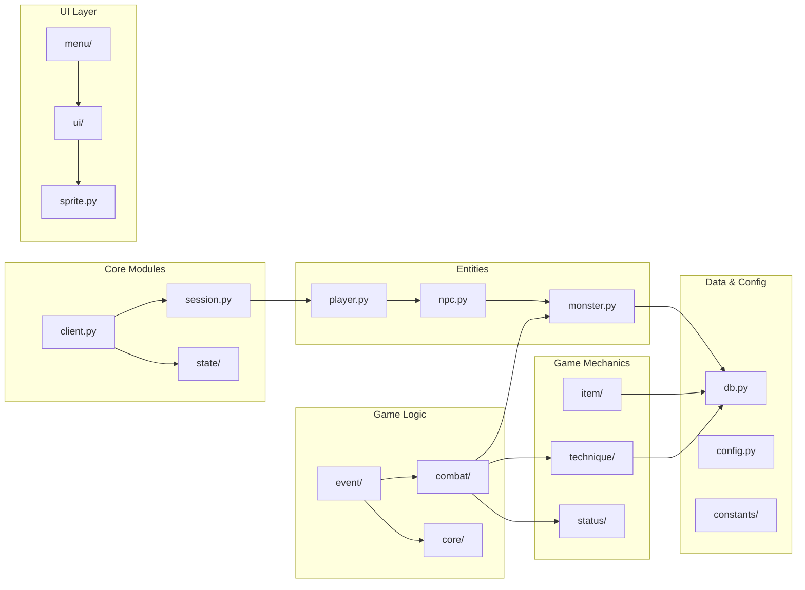
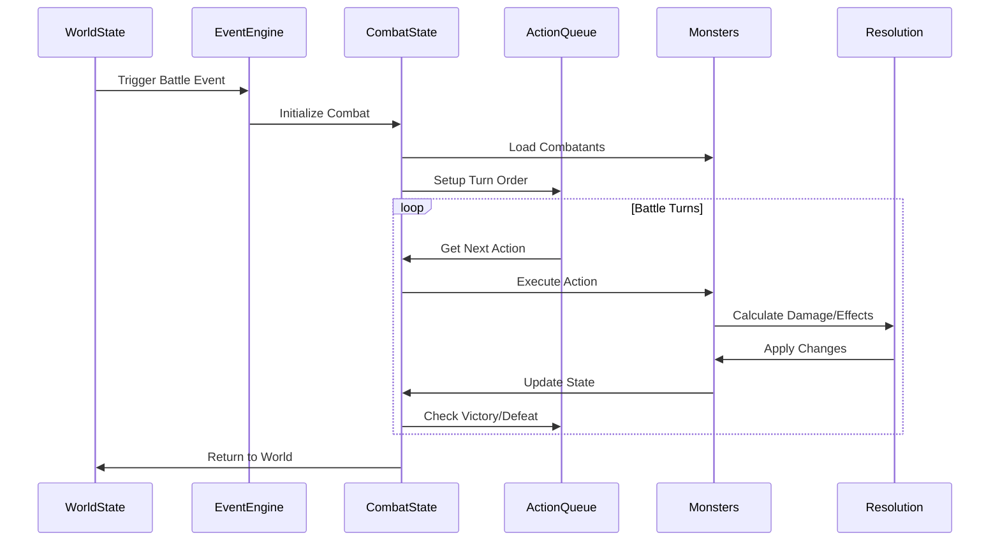
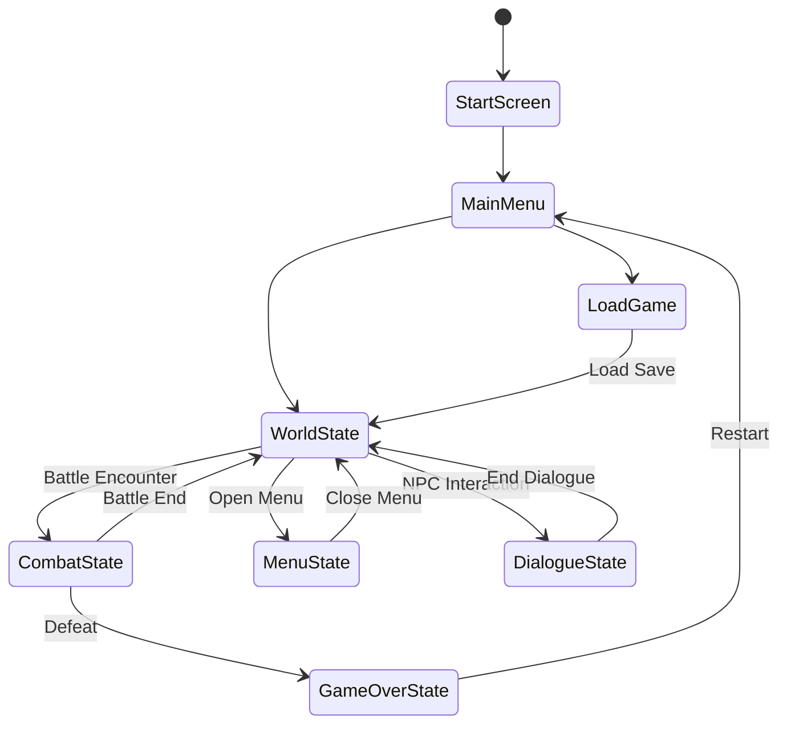
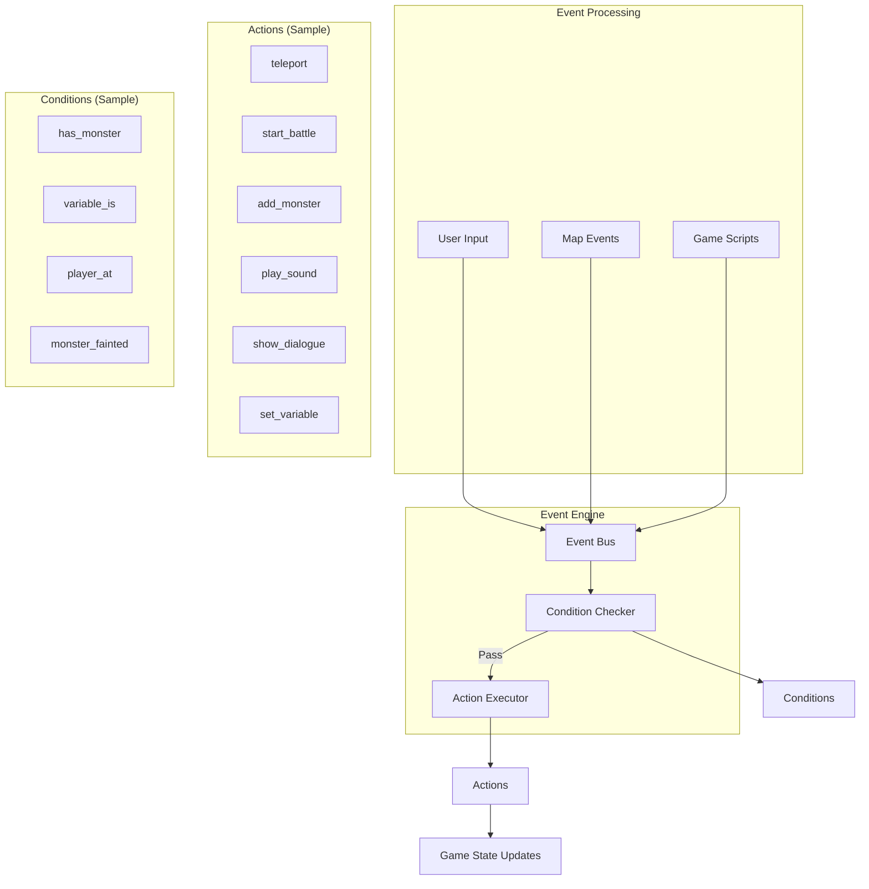
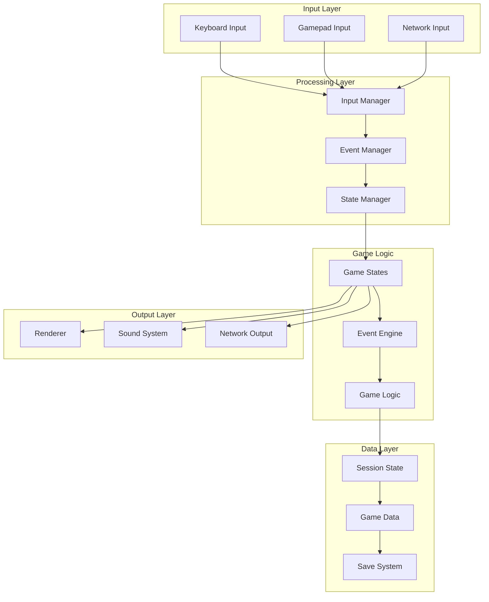

# SaiyanQuest Architecture Diagram

## High-Level Architecture Overview



## Module Dependencies



## Combat System Flow



## State Management Pattern



## Event System Architecture



## Key Design Patterns

| Pattern | Implementation | Purpose |
|---------|---------------|----------|
| **State Pattern** | StateManager, Game States | Manage different game screens |
| **Command Pattern** | Event Actions, Combat Queue | Encapsulate game actions |
| **Observer Pattern** | Event Bus, State Notifications | Decoupled communication |
| **Factory Pattern** | State Factory, Entity Creation | Object instantiation |
| **Repository Pattern** | State Repository, DB Models | Data access abstraction |
| **Manager Pattern** | Various Manager Classes | Subsystem management |
| **Plugin Architecture** | Dynamic Action/Condition Loading | Extensibility |

## Package Structure

```
saiyanquest/
├── __init__.py              # Package initialization
├── __main__.py              # CLI entry point
├── main.py                  # Main game entry
├── client.py                # Core game client
├── session.py               # Session management
├── config.py                # Configuration system
├── db.py                    # Database models
│
├── state/                   # State management system
│   ├── state_manager.py    # State stack management
│   ├── state.py            # Base state class
│   ├── state_factory.py    # State creation
│   └── state_repository.py # State registry
│
├── states/                  # Game state implementations
│   ├── world/              # World exploration
│   ├── combat/             # Battle system
│   ├── menu/               # Menu screens
│   └── transition/         # Screen transitions
│
├── event/                   # Event system
│   ├── eventengine.py      # Core event processor
│   ├── actions/            # 100+ action classes
│   └── conditions/         # Condition evaluators
│
├── combat/                  # Combat mechanics
│   ├── combat_state.py     # Battle management
│   ├── action_queue.py     # Turn management
│   └── damage.py           # Damage calculations
│
├── ui/                      # User interface
│   ├── combat_*.py         # Combat UI components
│   ├── text_*.py           # Text rendering
│   └── dialogue.py         # Dialogue system
│
├── core/                    # Core game logic
├── item/                    # Item system
├── technique/               # Move/ability system
├── status/                  # Status effects
├── menu/                    # Menu implementations
└── constants/               # Game constants
```

## Data Flow Overview



This architecture demonstrates a well-structured, modular game design with clear separation of concerns, extensive use of design patterns, and a flexible event-driven system that allows for easy content creation and game expansion.